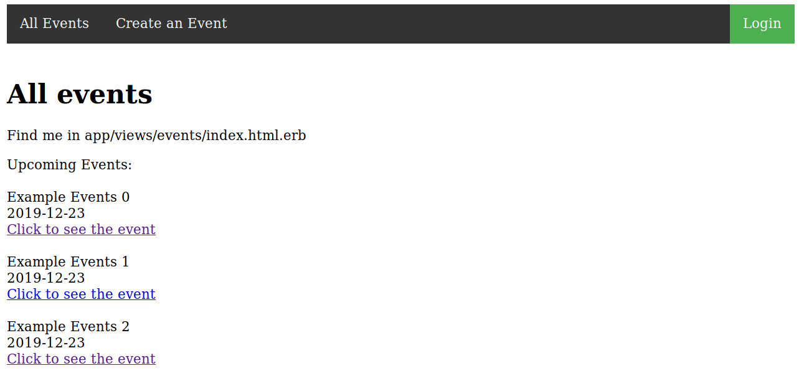

# Members Only

> In this project we built a site similar to a private Eventbrite which allows users to create events and then manage user signups. Users can create events and send invitations and parties. Events take place at a specific date and at a location.

## Built With

- Ruby
- Ruby on Rails, Bootstrap

### Requirements

* Ruby 2.6.3

### Installation

* Download repository to your local machine, then run `bundle install`, `rails db:migrate` and `rails db:seed` (for an example database).

## Authors

👤 **Aaron Rory**

- Github: [@Aaron-RN](https://github.com/Aaron-RN)
- Twitter: [@ARNewbold](https://twitter.com/ARNewbold)
- Linkedin: [Aaron Newbold](https://www.linkedin.com/in/aaron-newbold-1b9233187/)

👤 **Thaís Vieira Azevedo**

- Github: [@thsvr](https://github.com/githubhandle)
- Twitter: [@vr_ths](https://twitter.com/vr_ths)
- Linkedin: [Thaís V.](https://www.linkedin.com/in/vr-ths-zd/)

## 🤝 Contributing

Contributions, issues and feature requests are welcome!

Feel free to check the [issues page](issues/).

## Show your support

Give a ⭐️ if you like this project!

## 📝 License

This project is [MIT](lic.url) licensed.
